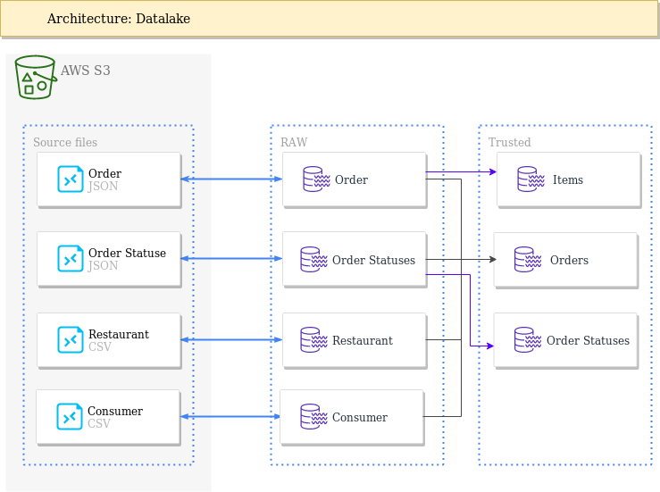

# iFood Data Architect Test

## Test Scope

Process semi-structured data and build a datalake that provides efficient storage and performance. The datalake must be organized in the following 2 layers:
* raw layer: Datasets must have the same schema as the source, but support fast structured data reading
* trusted layer: datamarts as required by the analysis team

Use whatever language, storage and tools you feel comfortable to. 

Also, briefly elaborate on your solution, datalake architecture, nomenclature, partitioning, data model and validation method.

Once completed, you may submit your solution to ifoodbrain_hiring@ifood.com.br with the subject: iFood DArch Case Solution / Candidate Name.

## Requirements

* Source files:
  * Order: s3://ifood-data-architect-test-source/order.json.gz
  * Order Statuses: s3://ifood-data-architect-test-source/status.json.gz
  * Restaurant: s3://ifood-data-architect-test-source/restaurant.csv.gz
  * Consumer: s3://ifood-data-architect-test-source/consumer.csv.gz 
* Raw Layer (same schema from the source):
  * Order dataset.
  * Order Statuses dataset.
  * Restaurant dataset.
  * Consumer dataset.
* Trusted Layer:
  * Order dataset -  one line per order with all data from order, consumer, restaurant and the LAST status from order statuses dataset. To help analysis, it would be a nice to have: data partitioned on the restaurant LOCAL date.
  * Order Items dataset - easy to read dataset with one-to-many relationship with Order dataset. Must contain all data from _order_ items column.
  * Order statuses - Dataset containing one line per order with the timestamp for each registered event: CONCLUDED, REGISTERED, CANCELLED, PLACED.
* For the trusted layer, anonymize any sensitive data.
* At the end of each ETL, use any appropriated methods to validate your data.
* Read performance, watch out for small files and skewed data.

## Non functional requirements
* Data volume increases each day. All ETLs must be built to be scalable.
* Use any data storage you feel comfortable to.
* Document your solution.

## Hints
* Databricks Community: https://community.cloud.databricks.com
* all-spark-notebook docker: https://hub.docker.com/r/jupyter/all-spark-notebook/
